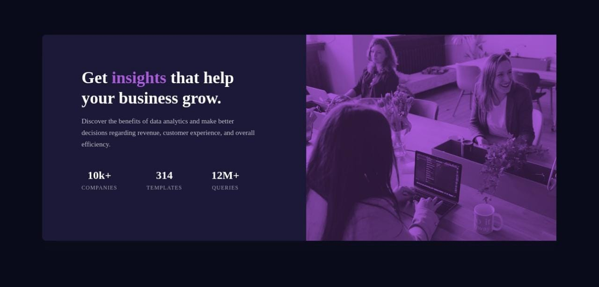
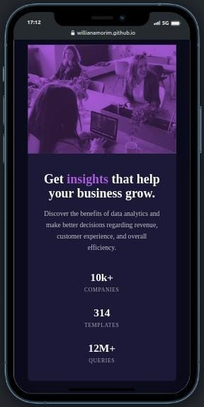

# Componente cartão visualização

Descrição breve do que o projeto faz

## Tecnologias Utilizadas

- HTML Semântico
- Propriedades CSS
- Flexbox
- Abordagem mobile-first

## Como Usar

1. Clone o repositório
2. Execute o projeto com `dois clicks no index.html` ou coma extensão `Go Live` do VsCode.

## Layout e Design

É basicamente um cartão de visualização, com algumas informações e uma imagem.

## Link do Deploy
https://willianamorim.github.io/Componente-cartao-visualizacao/

## Como Contribuir

1. Clone o repositório
2. Faça as mudanças necessárias e crie um novo branch com o nome da sua funcionalidade
3. Envie um pull request

## Contato

Entre em contato comigo pelo `e-mail` willianamorim1@outlook.com.br ou pelo `LinkedIn` https://www.linkedin.com/in/willian-s-amorim/.